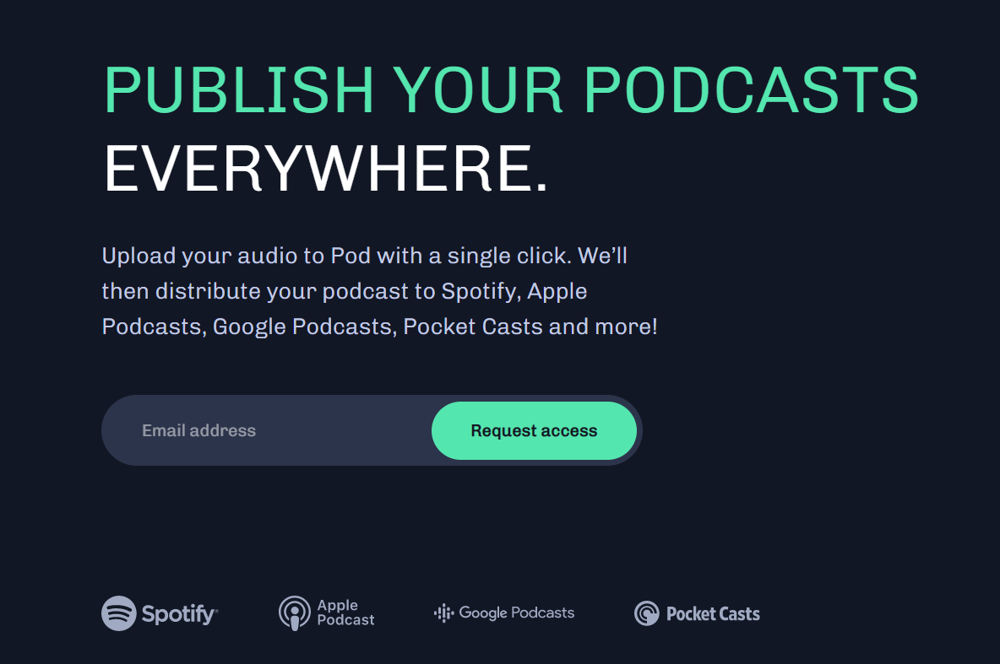
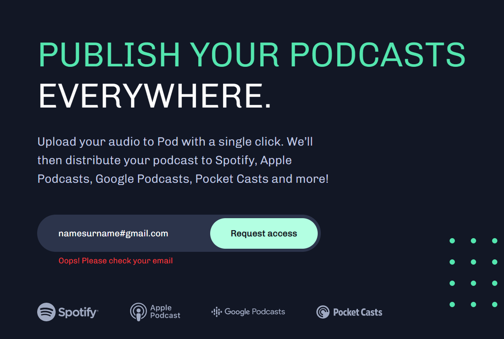

# Frontend Mentor - Pod request access landing page solution

## Table of contents

- [Overview](#overview)
  - [The challenge](#the-challenge)
  - [Screenshot](#screenshot)
  - [Links](#links)
- [My process](#my-process)
  - [Built with](#built-with)
  - [What I learned](#what-i-learned)
  - [Continued development](#continued-development)
- [Acknowledgments](#acknowledgments)

## Overview

This is a solution to the [Pod request access landing page challenge on Frontend Mentor](https://www.frontendmentor.io/challenges/pod-request-access-landing-page-eyTmdkLSG).

### The challenge

The challenge was to build out an early access landing page based on Figma design, so that the users are able to view the optimal layout depending on their device's screen size. Also, users should receive an error message when the form is submitted if the email address field is empty or the email is not formatted correctly.

### Screenshot

### Links

- Solution URL: [Solution URL here](https://github.com/NunuAbuashvili/Pod-Request-Access-Landing-Page.git)
- Live Site URL: [Live site URL here](https://nunuabuashvili.github.io/Pod-Request-Access-Landing-Page/)

## My process

### Built with

- Semantic HTML5 markup
- CSS custom properties
- Flexbox
- CSS Grid
- Mobile-first workflow
- JavaScript

### What I learned

In previous projects an error message appeared when the form was submitted only if the email was not formatted correctly, an error message for the empty field was a new experience to work on.

### Continued development

I would like to work more on JavaScript in future projects, and make my pages more interactive.

## Acknowledgments

I would like to thank Bitcamp 101 (Georgia) for offering amazing lectures, and also, my mentor Paata Gharibashvili who has helped me overcome difficulties by giving me a lot of valuable advice.
